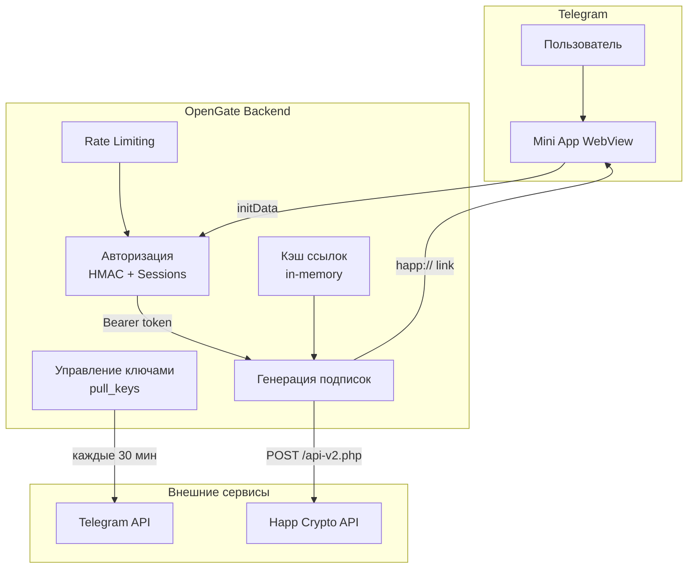
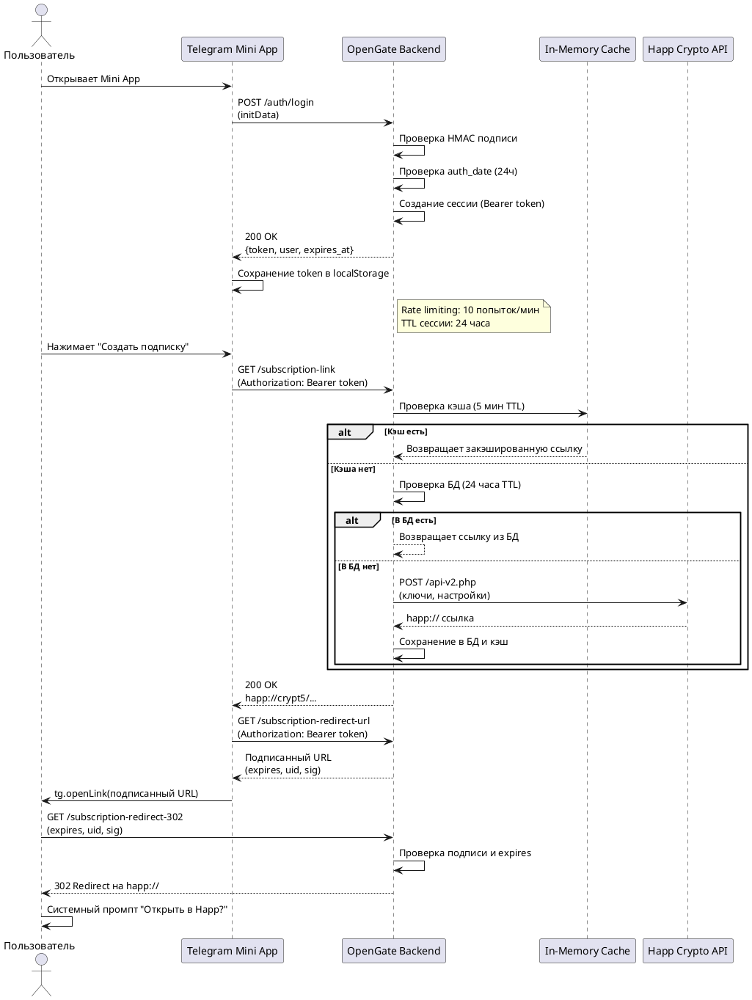

# Архитектура

## Обзор

OpenGate — это монолитное FastAPI-приложение, развёрнутое на Railway. Система состоит из трёх основных компонентов:

1. **Backend (FastAPI)** — обработка запросов, авторизация, генерация подписок
2. **Telegram Mini App** — фронтенд, работающий внутри Telegram
3. **Внешние сервисы** — Happ crypto API, Telegram API

## Диаграмма потока данных



## Диаграмма последовательности авторизации



## Компоненты

### 1. Авторизация (`verify_init_data`)

**Поток авторизации:**

1. Пользователь открывает Mini App в Telegram
2. Telegram передаёт `initData` (подписанные данные о пользователе)
3. Backend проверяет HMAC-SHA256 подпись `initData`
4. Проверяется свежесть данных (`auth_date` не старше 24 часов)
5. Создаётся сессия (Bearer token) с TTL 24 часа
6. Токен сохраняется в `localStorage` на клиенте

**Защита:**
- Rate limiting: 10 попыток входа в минуту с одного IP
- HMAC-подпись гарантирует, что данные не подделаны
- Сессии хранятся в памяти (не персистентны)

### 2. Управление ключами (`pull_keys`)

**Как работает:**

1. Планировщик запускается каждые 30 минут
2. Запускает `scripts/pull_keys.py --once`
3. Скрипт скачивает ключи с удалённого источника
4. Ключи сохраняются в `data/keys.json` (JSON) и `key_updates` (SQLite)
5. Если задан `PUBLIC_BASE_URL` — запускается предварительное шифрование ссылок

**Хранение ключей:**
- `data/keys.json` — основной источник (JSON)
- `data/app.db` — таблица `key_updates` для истории

### 3. Генерация подписок

**Формат подписки:**

```text
#profile-title: OpenGate 12345
#profile-update-interval: 24
vless://server1...
vless://server2...
```

**JSON формат:**

```json
{
  "subscription": {
    "id": "default",
    "status": "active",
    "params": {
      "profile-title": "OpenGate 12345"
    }
  },
  "servers": [
    {
      "uri": "vless://...",
      "remarks": "Region",
      "meta": {
        "serverDescription": "Region"
      }
    }
  ]
}
```

### 4. Happ deep links

**Поток создания ссылки:**

1. Пользователь нажимает "Создать подписку"
2. Backend проверяет кэш → БД → crypto API (в этом порядке)
3. Получает `happ://` ссылку
4. Фронтенд открывает подписанный URL `/subscription-redirect-302`
5. Сервер возвращает 302-редирект на `happ://` ссылку
6. Системный браузер показывает "Открыть в Happ?"

**Кэширование:**
- In-memory кэш: 5 минут (TTL)
- БД: 24 часа (TTL ссылки)
- Crypto API: только при отсутствии в кэше/БД

### 5. Подписанные URL

**Формат подписи:**

```text
payload = "{filename}:{user_id}:{expires}"
sig = HMAC_SHA256(SIGNING_KEY, payload)
url = "{base_url}{filename}?expires={expires}&uid={user_id}&sig={sig}"
```

**Проверка:**
- `expires` — срок действия (24 часа)
- `uid` — ID пользователя
- `sig` — HMAC-подпись, защищающая от подделки

## База данных

### Схема SQLite

```sql
-- Пользователи
CREATE TABLE users (
    id INTEGER PRIMARY KEY,
    first_name TEXT,
    last_name TEXT,
    username TEXT,
    photo_url TEXT,
    access_status TEXT DEFAULT 'active',
    subscription_id TEXT DEFAULT 'default',
    created_at TEXT,
    updated_at TEXT,
    last_login_at TEXT
);

-- Подписки
CREATE TABLE subscriptions (
    id TEXT PRIMARY KEY,
    status TEXT DEFAULT 'active',
    title TEXT DEFAULT 'OpenGate',
    settings_json TEXT DEFAULT '{}',
    created_at TEXT,
    updated_at TEXT
);

-- Ключи (история)
CREATE TABLE key_updates (
    id INTEGER PRIMARY KEY AUTOINCREMENT,
    source_url TEXT,
    pulled_at TEXT,
    raw_updated_at TEXT,
    total_keys INTEGER,
    status TEXT,
    error TEXT
);

-- Зашифрованные ссылки
CREATE TABLE encrypted_links (
    user_id INTEGER PRIMARY KEY,
    encrypted_link TEXT,
    expires_at TEXT,
    updated_at TEXT
);
```

## Безопасность

### Реализованные меры

| Мера | Описание |
|------|----------|
| HMAC-подпись initData | Проверка подлинности данных Telegram |
| Rate limiting | 10 попыток входа/мин с IP |
| Подписанные URL | HMAC-SHA256 для файлов подписки |
| TTL ссылок | 24 часа |
| HTTPS | Все ссылки используют HTTPS (PUBLIC_BASE_URL) |
| Кэш с TTL | 5 минут для зашифрованных ссылок |

### Рекомендации

1. **SIGNING_KEY_HEX** — обязательно задать постоянный ключ на проде
2. **HTTPS** — убедиться, что `PUBLIC_BASE_URL` использует HTTPS
3. **Мониторинг** — добавить логирование failed auth attempts
4. **Резервное копирование** — `data/app.db` и `data/keys.json`

## Производительность

### Оптимизации

| Оптимизация | Эффект |
|-------------|--------|
| In-memory кэш ссылок | Мгновенные повторные запросы |
| Параллельные crypto API вызовы | 5x ускорение массового шифрования |
| Интервал проверки expiry (30с) | Меньше нагрузка на CPU |
| Named constants | Читаемость и поддерживаемость |

### Узкие места

1. **Crypto API** — внешний сервис, может быть медленным (1-15 сек)
2. **SQLite** — не подходит для высоких нагрузок
3. **In-memory сессии** — теряются при рестарте

## Деплой

### Railway

```json
{
  "build": {
    "builder": "DOCKERFILE",
    "dockerfilePath": "Dockerfile"
  },
  "deploy": {
    "startCommand": "sh -c 'python scripts/pull_keys.py --interval 30 & exec uvicorn app.main:app --host 0.0.0.0 --port ${PORT:-8080}'",
    "healthcheckPath": "/health",
    "restartPolicyType": "ON_FAILURE"
  }
}
```

### Docker

```dockerfile
FROM python:3.11-slim
WORKDIR /app
COPY requirements.txt .
RUN pip install --no-cache-dir -r requirements.txt
COPY app/ ./app/
COPY scripts/ ./scripts/
COPY data/ ./data/
EXPOSE 8080
CMD exec uvicorn app.main:app --host 0.0.0.0 --port ${PORT:-8080}